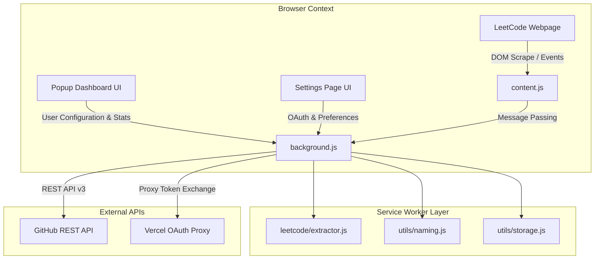

# LeetSync Project Analysis & Technical Architecture

---

## 📌 Project Overview

**LeetSync** is a modern **Google Chrome Extension (Manifest V3)** designed to automatically sync accepted LeetCode solutions directly to a user's GitHub repository. It automates portfolio building for developers by capturing solved problems, formatting them neatly by difficulty or category, and committing them to GitHub in real-time.

---

## 🏗️ Architecture & Component Breakdown

### Key Modules & Files

| File / Folder | Role & Description |
| --- | --- |
| [manifest.json](file:///C:/Users/kumar/OneDrive/Desktop/LeetCode-Github-Sync-main/manifest.json) | **Manifest V3 declaration** defining permissions (`storage`, `notifications`, `identity`), host permissions, background service worker, content script rules, and CSP. |
| [background.js](file:///C:/Users/kumar/OneDrive/Desktop/LeetCode-Github-Sync-main/background.js) | **Service Worker Core**: Orchestrates the sync queue (`syncQueue`), handles message routing, handles OAuth flow with GitHub via Vercel proxy, updates extension state, and pushes commits to GitHub. |
| [content.js](file:///C:/Users/kumar/OneDrive/Desktop/LeetCode-Github-Sync-main/content.js) | **Content Script**: Injected into `leetcode.com/problems/*`. Listens for submission events/DOM changes, extracts Monaco/CodeMirror editor code, and communicates with `background.js`. |
| [leetcode/extractor.js](file:///C:/Users/kumar/OneDrive/Desktop/LeetCode-Github-Sync-main/leetcode/extractor.js) | **LeetCode Extractor**: Robust extraction engine that scrapes problem title, ID, difficulty, tags, and code from Monaco Editor, CodeMirror, or GraphQL responses. |
| [github/api.js](file:///C:/Users/kumar/OneDrive/Desktop/LeetCode-Github-Sync-main/github/api.js) | **GitHub API Client**: Wrapper around GitHub REST API v3 for fetching/creating repositories, commits, trees, blobs, and checking rate limits. |
| [github/sync.js](file:///C:/Users/kumar/OneDrive/Desktop/LeetCode-Github-Sync-main/github/sync.js) | **Sync Manager**: Handles directory structure creation, incremental checks using `sync_log.json` on the remote repository to avoid redundant commits. |
| [utils/storage.js](file:///C:/Users/kumar/OneDrive/Desktop/LeetCode-Github-Sync-main/utils/storage.js) | **Storage Utility**: Manages `chrome.storage.local` settings, OAuth tokens, local problem history, and statistics. |
| [utils/naming.js](file:///C:/Users/kumar/OneDrive/Desktop/LeetCode-Github-Sync-main/utils/naming.js) | **File & Path Utility**: Formats file paths based on chosen directory structure (e.g., `Easy/0001-two-sum.py`), maps language extensions, formats commit messages, and builds README files. |
| [popup.html](file:///C:/Users/kumar/OneDrive/Desktop/LeetCode-Github-Sync-main/popup.html) / [popup.js](file:///C:/Users/kumar/OneDrive/Desktop/LeetCode-Github-Sync-main/popup.js) | **Analytics Dashboard**: Popup UI showing total solved problems breakdown (Easy, Medium, Hard), current language stats, sync queue status, and recent activity log. |
| [settings.html](file:///C:/Users/kumar/OneDrive/Desktop/LeetCode-Github-Sync-main/settings.html) / [settings.js](file:///C:/Users/kumar/OneDrive/Desktop/LeetCode-Github-Sync-main/settings.js) | **Settings Page**: Configuration UI for Personal Access Tokens (PAT) / GitHub OAuth, repository name selection, file organization patterns, commit templates, and manual backfill options. |

---

## ⚡ Core Functionality & Features

1. **Automatic Submission Sync**:
   - Captures code as soon as a submission receives an **Accepted** verdict on LeetCode.
2. **Smart Incremental Sync Engine**:
   - Maintains a remote `sync_log.json` on GitHub to verify whether a problem submission was previously synced, avoiding unnecessary API calls and redundant commits.
3. **Queue Architecture**:
   - Background worker processes submissions sequentially through an asynchronous queue (`MAX_QUEUE_LENGTH = 25`) to prevent race conditions during rapid submissions.
4. **Flexible Repository Organization**:
   - Supports multiple structure preferences:
     - By Difficulty (`Easy/`, `Medium/`, `Hard/`)
     - By Language (`Python3/`, `CPP/`, `Java/`)
     - Flat Structure
5. **Secure Authentication Options**:
   - **GitHub Personal Access Tokens (PAT)** (Direct API interaction)
   - **GitHub OAuth Web Flow** via secure Vercel proxy.
6. **Live Analytics Dashboard**:
   - Extension popup tracks stats (Total Solved, Difficulty Breakdown, Top Languages, Sync Logs).

---

## 🛠️ System Hardening & Bug Fixes

- **Expanded Language Mapping**: Full mapping for `golang`, `c#`/`csharp`, `sql`, `mysql`, `bash`/`shell`, `python3`, `dart`, `racket`, `erlang`, `elixir`.
- **Storage Session Guard**: Safe fallbacks for `chrome.storage.session` when session storage is disabled or unsupported.
- **Remote Log Hardening**: Guaranteed initialization of `remoteLog.problems` dictionary to prevent unhandled `TypeError` exceptions.
- **Multi-Selector Extraction**: Upgraded `content.js` DOM selectors to dynamically resolve problem ID, title, and difficulty on updated LeetCode UIs (2024–2026).
- **Graceful Avatar Handling**: Safe URL validation for avatar images across popup and settings windows.

---

## 💡 Technical Highlights & Design Strengths

* **Manifest V3 Compliant**: Uses ESM (`type: module`) in the background service worker, replacing deprecated V2 background pages.
* **Multi-Layer Scraper Resilience**: `leetcode/extractor.js` attempts extraction via Monaco Editor models first, falling back to CodeMirror, textareas, and DOM node scraping.
* **Security Scoping & Validation**: `background.js` strictly validates trusted origins (`chrome.runtime.id`, `leetcode.com`, Vercel HTTPS endpoints) and sanitizes input data to prevent injection vulnerabilities.
* **Stateless Multi-Device Sync**: Relying on remote state tracking on GitHub allows the extension to function seamlessly across multiple machines.

---

## 🚀 Setup & Installation Guide

1. Open Google Chrome and navigate to `chrome://extensions/`.
2. Toggle **Developer mode** on in the top-right corner.
3. Click **Load unpacked** and select the extension directory folder (`LeetCode-Github-Sync-main`).
4. Click the extension icon and open Settings to configure GitHub authentication (Personal Access Token or OAuth) and your target repository.
