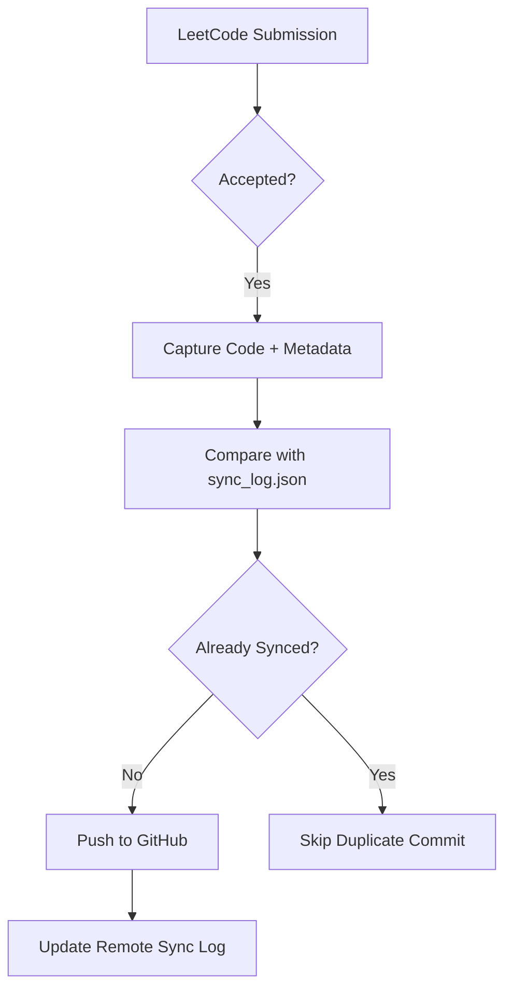

# 🚀 LeetSync  
### *Turn Your LeetCode Journey into a Professional GitHub Portfolio*

<p align="center">
  
  
  
  
</p>

---

# 📌 Overview

**LeetSync** is a Chrome Extension designed to automatically sync your accepted LeetCode submissions directly to GitHub — transforming your coding practice into a polished, recruiter-friendly portfolio.

Unlike traditional sync tools, **LeetSync** introduces a **Smart-Log Engine** that intelligently tracks submission history, avoids redundant commits, and minimizes unnecessary API calls.

Whether you're preparing for placements, internships, or showcasing consistency to recruiters, LeetSync helps maintain a clean and professional coding repository effortlessly.

---

# ✨ Features

## ⚡ Instant Automation
Automatically pushes code to GitHub the moment your solution gets an **Accepted** verdict on LeetCode.

- No manual uploads
- No copy-pasting
- Seamless workflow

---

## 🧠 Smart Incremental Sync Engine
LeetSync maintains a lightweight `sync_log.json` file that stores submission metadata.

This enables:
- Detection of new submissions
- Prevention of duplicate commits
- Reduced GitHub API requests
- Efficient incremental synchronization

---

## 📅 Chronological Submission Backups
Reconstruct your LeetCode history in chronological order.

This ensures:
- Your GitHub contribution graph reflects actual coding activity
- Historical consistency across repositories
- Accurate progress visualization

---

## 📂 Professional Repository Organization
Solutions are automatically categorized using:
- Difficulty (`Easy`, `Medium`, `Hard`)
- Topics/Tags
- Custom naming conventions

### Example Structure

```bash
LeetCode-Solutions/
│
├── Easy/
│   ├── Two_Sum.cpp
│   └── Valid_Parentheses.cpp
│
├── Medium/
│   ├── Group_Anagrams.cpp
│   └── Longest_Substring.cpp
│
└── Hard/
    └── Median_of_Two_Sorted_Arrays.cpp
```

---

## 📊 Live Analytics Dashboard
The extension popup includes a real-time analytics dashboard showing:

- Total solved problems
- Language usage distribution
- Sync history
- Recent submissions
- GitHub sync status

---

# 🏗️ Technical Highlights

## 🧩 Architecture
Built using **Chrome Manifest V3** for:
- Improved security
- Better performance
- Modern browser compatibility

---

## 🔗 GitHub API Integration
Uses the **GitHub REST API v3** for:

- Repository management
- File creation/updation
- Commit handling
- Sync state management

---

## ⚙️ Asynchronous State Management
Implements a **sync queue architecture** to handle rapid consecutive submissions.

### Benefits
- Prevents race conditions
- Ensures ordered commits
- Avoids API conflicts
- Handles high-frequency events reliably

---

## 🛡️ Remote-Log Synchronization
LeetSync follows a **stateless synchronization strategy**.

Instead of relying on local browser storage:
- Sync state is fetched directly from GitHub
- Works seamlessly across multiple devices/browsers
- Prevents local-data corruption issues

---

# 🧠 How It Works



---

# 🛠️ Tech Stack

| Technology | Purpose |
|---|---|
| Chrome Extension API | Browser Integration |
| Manifest V3 | Extension Architecture |
| GitHub REST API v3 | Repository Management |
| JavaScript | Core Logic |
| HTML/CSS | Popup UI |
| Async Queues | State Handling |
| JSON-based Logs | Incremental Sync |

---

# 🚀 Installation

## 1️⃣ Clone the Repository

```bash
git clone https://github.com/your-username/LeetSync.git
```

---

## 2️⃣ Open Chrome Extensions

Navigate to:

```bash
chrome://extensions/
```

Enable:
- ✅ Developer Mode

---

## 3️⃣ Load the Extension

Click:

```bash
Load unpacked
```

Select the project folder.

---

## 4️⃣ Configure GitHub Access

Provide:
- GitHub Username
- Personal Access Token
- Repository Name

---

# 📈 Why LeetSync?

LeetSync is more than just a sync extension.

It acts as:
- A coding activity tracker
- A GitHub portfolio builder
- A productivity automation tool
- A contribution graph enhancer

Perfect for:
- Students
- Placement preparation
- Open-source portfolios
- Competitive programmers

---

# 🔮 Future Enhancements

- 🌐 Multi-platform support (Codeforces, GFG, AtCoder)
- ☁️ Cloud sync support
- 📊 Advanced analytics dashboard
- 🤖 AI-generated problem summaries
- 🏷️ Automatic topic tagging
- 📱 Companion mobile dashboard

---

# 🤝 Contributing

Contributions are welcome!

Feel free to:
- Open issues
- Suggest features
- Submit pull requests

---

# 📜 License

This project is licensed under the **MIT License**.

---

# ⭐ Support

If you found this project useful:

- ⭐ Star the repository
- 🍴 Fork the project
- 🧑‍💻 Share with fellow developers

---

<p align="center">
  Built with ❤️ for developers striving for consistency.
</p>
